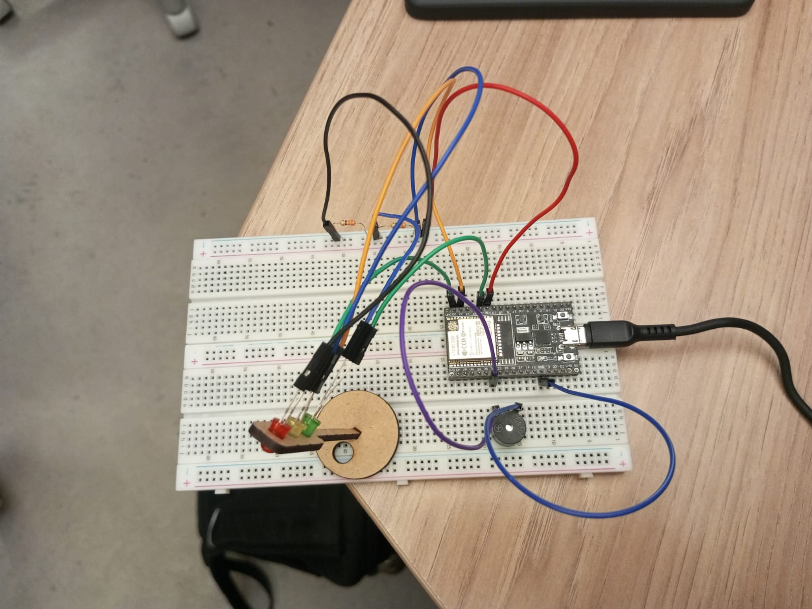
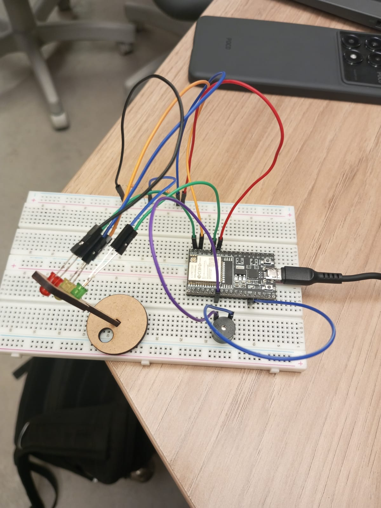

## Relato das conexões e montagem.

&nbsp;&nbsp;&nbsp;&nbsp;A montagem inicial foi realizada no TinkerCad utilizando um Arduino. Após a testagem bem-sucedida, todo o protótipo foi transferido para um protoboard físico, utilizando um ESP32.

- Pino do led vermelho: 23
- Pino do led amarelo: 22
- Pino do led verde: 21
- Pino do buzzer: 32

&nbsp;&nbsp;&nbsp;&nbsp;Primeiramente, foram implementados os LEDs, conectando-os corretamente aos pinos de terra e às portas apropriadas para prosseguir com a programação. Os pinos negativos dos LEDs foram conectados à parte negativa da protoboard, cada um utilizando jumpers M-F, que foram ligados ao pino GND do ESP32 através de resistores de 330Ω, garantindo que a energia passasse por todos os negativos utilizando um jumper M-M. Já os terminais positivos dos LEDs foram conectados diretamente ao ESP32, cada um no seu respectivo pino, com jumpers M-F.

&nbsp;&nbsp;&nbsp;&nbsp;O buzzer foi conectado ao pino 32 do ESP32 e ao GND utilizando dois jumpers M-M. Com todas as conexões concluídas, ele foi devidamente configurado no código.

&nbsp;&nbsp;&nbsp;&nbsp; Com a montagem finalizada, passamos para a lógica do código. O programa começa acendendo o LED verde por 2 segundos, em seguida o apaga e acende o LED amarelo. Após 2 segundos, o LED vermelho começa a piscar junto com o amarelo por 3 segundos, indicando que o sinal está prestes a fechar. Em seguida, apenas o LED vermelho permanece aceso por mais 3 segundos, totalizando 6 segundos. Além disso, enquanto o LED vermelho está aceso, o buzzer é acionado para sinalizar que o farol está fechado.

Tabela 1 - Componentes
|Componentes|	Quantidade|
|-|-
|Led vermelho | 1 | 
|Led amarelo | 1 |
|Led verde | 1 |
| Jumper M-F | 6 |
| Jumper M-M | 3 |
| ESP32 | 1 |
| Cabo USB-C | 1 |
| Resistores 330 Ohms | 1|
| Buzzer | 1
| Protoboard | 1 |

___

Figura 1 - Montagem do semáforo  
 
Fonte: Material produzido pelo autor (2024)

Figura 2 - Montagem do semáforo  
 
Fonte: Material produzido pelo autor (2024)

___ 

- Vídeo do funcionamento do semáforo : https://youtu.be/_JovdRXdNqI?si=K3SmqKqdyq6pHful